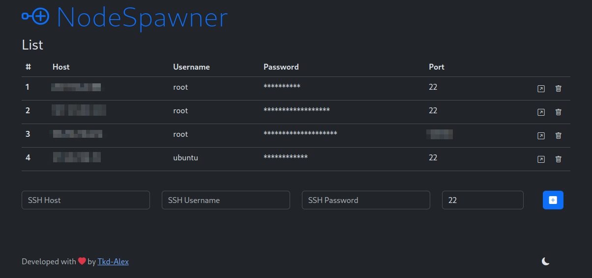
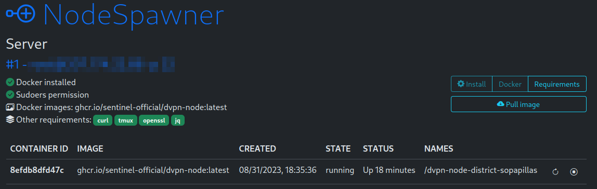
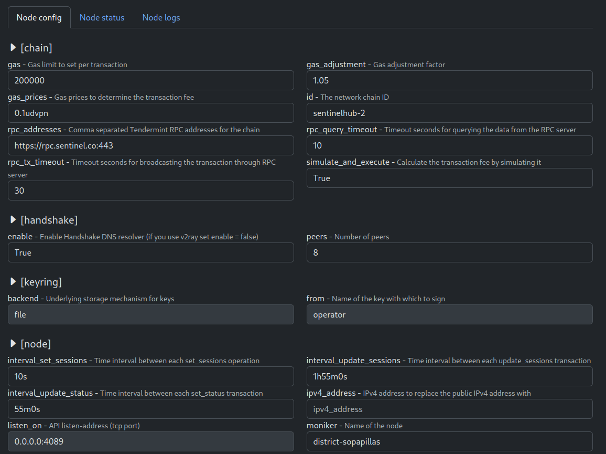
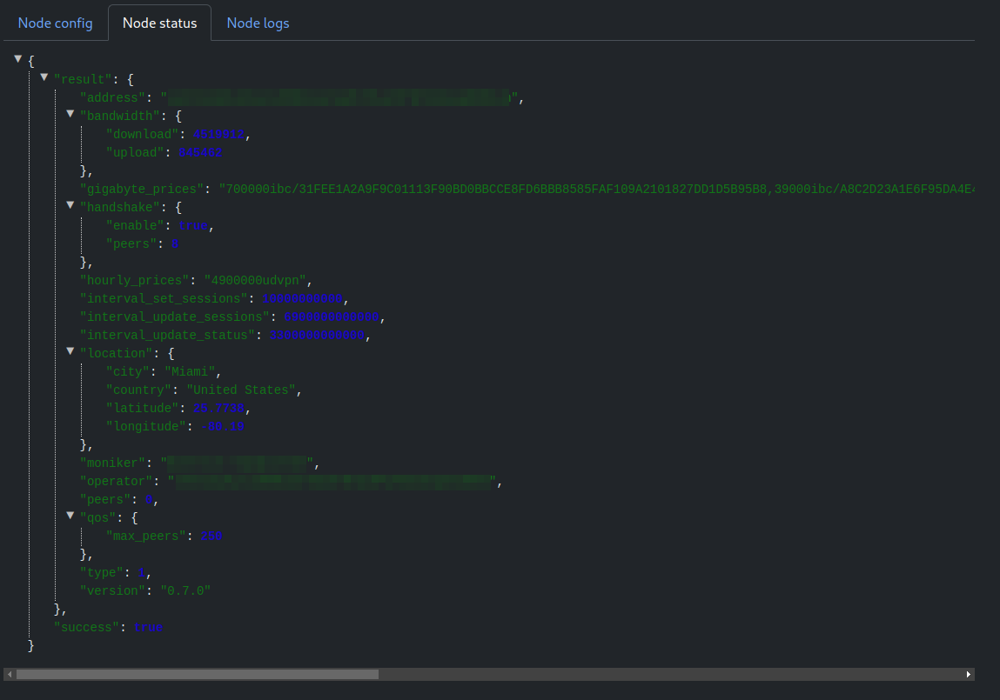
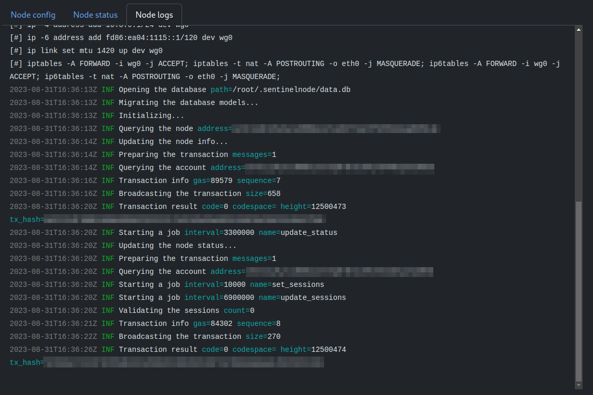

## dvpn-node-spawner
NodeSpawner is a dashboard for manager & spawn [dvpn-node](https://github.com/sentinel-official/dvpn-node).

<a href="https://github.com/Tkd-Alex/dvpn-node-spawner/blob/master/LICENSE"></a>
<a href="https://www.python.org/downloads/release/python-310/"></a>
<a href="https://github.com/Tkd-Alex/dvpn-node-spawner/pulls"></a>
<a href="https://github.com/Tkd-Alex/dvpn-node-spawner/stargazers"></a>
<a href="https://github.com/Tkd-Alex/dvpn-node-spawner/forks"></a>
<a href="https://github.com/Tkd-Alex/dvpn-node-spawner/issues?q=is%3Aissue+is%3Aclosed"></a>
<a href="https://github.com/Tkd-Alex/dvpn-node-spawner"></a>

### How to run
```bash
virtualenv -p python3 venv
source venv/bin/activate
pip install -r requirements.txt
python main.py
```
Easy right? Just install the python requirements and start the main.py file 😎

### Details
#### SSH Connection
- The ssh comunication can be done via password or via private-key auth (not already tested).
- We need a sudoers permission in order to execute some commands (like docker/requirements install).
- All the server info (host, username, password, port) are stored locally on a sqlite database.
#### Requirements
- **Docker**
- **curl**, used for contact some ipinfo website and download bash script
- **tmux**, used for handle non-deamon container / especially useful when the keywring is setup as 'file' and we need to submit a wallet password
- **openssl**, used for create SSL certificate that will be used to server on https the /status page
- **jq**, used for parsing the output of ipinfo website
#### Management
The dashboard was developed on free time and it may not be perfect;
- After some actions like start/restart stop and so on the page must be refreshed.
- The logs are not live but will be refreshed each time you click on "Node logs" tab
- Most of the default configuration are take from [Trinity dVPN Guides](https://trinityvalidator.com/docs/sentinelguides/node/node-config), like `gigabyte_prices` and `hourly_prices` values. The default configuration is stored on [handlers/Config.py](handlers/Config.py) file and in case of update by [dvpn-node](https://github.com/sentinel-official/dvpn-node), the file could need updates.
- Configuration like udp port / tcp port / moniker and generated randomly.
- With the dashboard you can pull the latest image from [official dvpn-node image](https://github.com/sentinel-official/dvpn-node/pkgs/container/dvpn-node). Btw, if you have already by your self the image the dashboard will handle only images that ends with `dvpn-node` or `dvpn-node:latest`. Images like: `sentine-dvpn-node` are also valid.
#### Keyring
In order to handle the keyring will be use the [Sentinel CLI client](https://github.com/sentinel-official/cli-client).
Based on your OS, the script will automatically download the client from [freQniK release v0.3.1](https://github.com/freQniK/cli-client/releases/download/v0.3.1) (after the hub upgrade we don't have an official one). The client will work on /tmp folder, once the wallet is created / recovered the files will be uploaded on the server and the /tmp folder will be deleted.
#### Know bugs / Not tested / Future improvements
- The ssh authentication via private key was not tested
- The keyring with backend as 'file' could have some issue linked to the password input. For example if you restart a container trougth the dashboard, probably the node will never start because is waiting for a input.
- Currently, if you save a node configuration, the container must be manually restarted (can be done via dashboard) - We could evaluate an auto restart.
- The [firewall](https://trinityvalidator.com/docs/sentinelguides/node/node-config#enable-firewall-ports) part is currently not managed, I found a lot of VPS/Hosting services without the ufw package or firwall rules - so, for the moment is not managed by the dasbhoard.
- My skills on frontend side are very limited, forgive me about the simple bootstrap page (btw, dark mode and light mode are managed 😄)

### Screenshot





